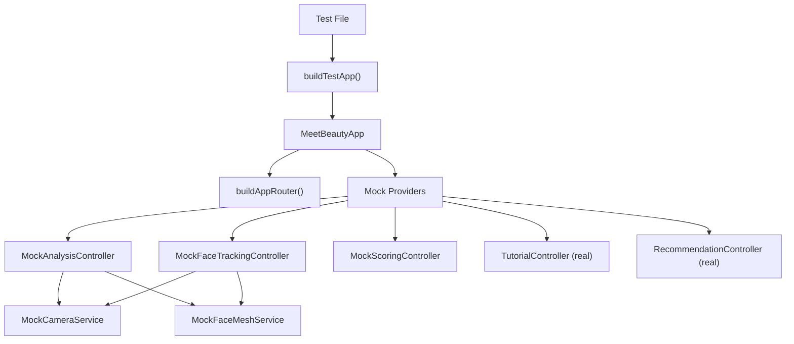

# Testing Guide

本文档说明 Meet Beauty 项目的测试策略、架构设计、运行命令及编写新测试的方法。

---

## 1. Overview

**策略**：使用 Flutter 官方 `integration_test` SDK，配合手写 Mock 服务层，在 Android 模拟器上进行端到端 BDD 风格测试，**无需真实摄像头或 ML Kit 硬件支持**。

**测试框架**：
- `flutter_test`（SDK 内置）— widget/unit 测试基础 API
- `integration_test`（SDK 内置）— 驱动完整应用实例，在真机/模拟器上运行端到端测试

**不使用**第三方 mock 库（如 `mockito`）；所有 mock 为手写子类，直接覆盖关键方法。

---

## 2. Test Architecture

```
integration_test/
├── smoke_test.dart                    # 冒烟测试
├── home_flow_test.dart                # 首页流程
├── analysis_recommendation_test.dart  # 分析→推荐流程
├── tutorial_flow_test.dart            # 教学→结果流程
├── helpers/
│   └── test_app.dart                  # buildTestApp() 辅助函数
└── mocks/
    ├── mock_camera_service.dart
    ├── mock_face_mesh_service.dart
    ├── mock_face_tracking_controller.dart
    ├── mock_analysis_controller.dart
    └── mock_scoring_controller.dart
```

### 依赖注入层次



每次测试调用 `buildTestApp()` 都会创建全新的 `GoRouter` 实例，确保路由状态不跨用例泄漏。

---

## 3. Running Tests

### 环境要求

- Flutter SDK 3.11+
- Android 模拟器（推荐 API 34）或 Android 真机
- 确认设备在线：`flutter devices`

### 运行命令

```bash
# 列出可用设备
flutter devices

# 运行全部集成测试
flutter test integration_test/ -d <device-id>

# 运行单个测试文件
flutter test integration_test/home_flow_test.dart -d <device-id>

# 运行 widget/unit 测试（不需要设备）
flutter test test/

# 静态分析（运行测试前建议先执行）
flutter analyze
```

**示例**（Android 模拟器）：

```bash
flutter test integration_test/ -d emulator-5554 --reporter=expanded
```

> **重要**：`pumpAndSettle()` 在 `integration_test` + GoRouter 组合下会无限挂起（GoRouter 持续调度帧），所有测试均使用 `pump(Duration(...))` 固定等待时间替代。

---

## 4. Mock Layer

### Mock 文件说明

| 文件 | 替代目标 | 关键行为 |
|------|----------|----------|
| `mocks/mock_camera_service.dart` | `CameraService` | `initialize()` 立即成功；`startImageStream` 空操作；`dispose()` 打印日志但不操作硬件 |
| `mocks/mock_face_mesh_service.dart` | `FaceMeshService` | 返回静态 `fakeLandmarks` / `fakeFeatureResult`；`detectFace()` 可按 `simulateFaceDetected` 开关控制 |
| `mocks/mock_face_tracking_controller.dart` | `FaceTrackingController` | `startTracking()` 直接进入 `TrackingState.tracking`；可选 `withFace: true` 同时发布假 `FaceLandmarks` |
| `mocks/mock_analysis_controller.dart` | `AnalysisController` | `startAnalysis()` 立即设置"有脸"状态；`completeAnalysis()` 产出固定 `FaceFeatureResult` |
| `mocks/mock_scoring_controller.dart` | `ScoringController` | 构造时预置分数（100 分、5 星），结果页无需等待 loading |

### buildTestApp() 辅助函数

`integration_test/helpers/test_app.dart` 封装了完整的 Provider 注入：

```dart
Widget buildTestApp({bool withFace = false}) {
  return MeetBeautyApp(
    routerConfig: buildAppRouter(),   // 每次创建新 GoRouter
    overrideProviders: [
      ChangeNotifierProvider<AnalysisController>(
        create: (_) => MockAnalysisController(),
      ),
      ChangeNotifierProvider<FaceTrackingController>(
        create: (_) => MockFaceTrackingController(withFace: withFace),
      ),
      // TutorialController / RecommendationController 使用真实实现
      // ScoringController 使用预置分数的 MockScoringController
    ],
  );
}
```

`withFace: true` 时，`MockFaceTrackingController` 会同时发布假 `FaceLandmarks`，用于需要验证 AR overlay 的测试场景。

---

## 5. Test Coverage

| 文件 | 用例数 | 覆盖流程 |
|------|--------|----------|
| `smoke_test.dart` | 1 | 应用启动、首页渲染 |
| `home_flow_test.dart` | 3 | 首页内容展示（标题/副标题/功能亮点）、`Start Learning` 导航到分析页 |
| `analysis_recommendation_test.dart` | 5 | 分析页 UI、`Capture & Analyze` → `Get Recommendations`、推荐页文案与步骤数、进入教学页 |
| `tutorial_flow_test.dart` | 5 | 三步教学前进/后退、`完成教学` 到结果页（含分数）、`Home` 返回首页、`Practice Again` 重新进入教学 |

**合计：14 个测试用例，全部在 Android API 34 模拟器验证通过。**

---

## 6. Writing New Tests

### 基本模板

```dart
import 'package:flutter_test/flutter_test.dart';
import 'package:integration_test/integration_test.dart';

import 'helpers/test_app.dart';

void main() {
  IntegrationTestWidgetsFlutterBinding.ensureInitialized();

  group('功能名称', () {
    testWidgets('用例描述', (tester) async {
      // 1. 构建应用
      await tester.pumpWidget(buildTestApp());
      await tester.pump(const Duration(seconds: 2));

      // 2. 断言初始状态
      expect(find.text('Meet Beauty'), findsOneWidget);

      // 3. 模拟操作（点击 + 等待导航）
      await tester.tap(find.text('Start Learning'));
      await tester.pump(const Duration(milliseconds: 300));
      await tester.pump(const Duration(milliseconds: 300));
      await tester.pump(const Duration(milliseconds: 500));

      // 4. 断言目标状态
      expect(find.text('Face Analysis'), findsOneWidget);
    });
  });
}
```

### 等待策略

| 场景 | 推荐写法 |
|------|----------|
| 初始渲染稳定 | `pump(Duration(seconds: 2))` |
| 导航动画完成 | 分三次 pump：300ms + 300ms + 500ms |
| 页面内异步更新 | `pump(Duration(milliseconds: 500))` |
| **禁止使用** | ~~`pumpAndSettle()`~~ |

### 扩展 Mock

如需模拟特殊场景（如相机权限被拒绝），继承对应 mock 类并覆盖目标 getter：

```dart
class PermissionDeniedCameraService extends MockCameraService {
  @override
  CameraStatus get status => CameraStatus.permissionDenied;
}
```

然后在 `buildTestApp()` 调用处传入自定义实现：

```dart
ChangeNotifierProvider<FaceTrackingController>(
  create: (_) => MockFaceTrackingController(
    cameraService: PermissionDeniedCameraService(),
  ),
),
```

### 同一文件内多用例的注意事项

- 每个 `testWidgets` 调用 `pumpWidget(buildTestApp())` 时会创建全新的 `GoRouter`，路由状态已自动隔离
- 每次测试的 Provider 实例也是独立新建的，无需手动 reset 状态

---

## 7. Known Limitations

| 限制 | 说明 |
|------|------|
| `pumpAndSettle()` 不可用 | GoRouter 内部有持续帧调度，`pumpAndSettle()` 永远不会 idle，必须用 `pump(Duration)` 替代 |
| 模拟器无真实人脸 | AR 渲染 pipeline（`OverlayRenderer` + `FaceMesh` 坐标变换）依赖真实相机帧，需在真机上手动验证 |
| `TutorialPage` 生命周期约束 | `stopTracking()` 不能在 `deactivate()`/`dispose()` 阶段调用（会触发 widget tree 锁定断言），已移至 `_completeTutorial()` 和关闭按钮回调 |
| Mock 分数固定 | `MockScoringController` 预置 100 分，如需测试不同分数段需自定义子类 |
